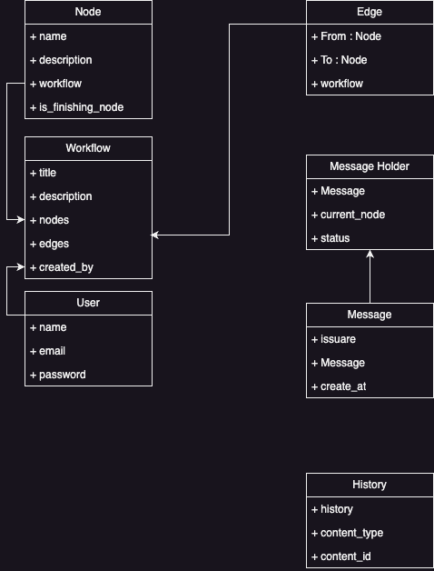

# FlexFlow API

FlexFlow API is a RESTful application that allows you to create and manage workflows for your company. With this API, you can define the steps of your workflow and connect them to create a seamless process for handling messages and approvals.

## Features

- Create and manage workflows.
- Add nodes (steps) to your workflows.
- Connect nodes to define the flow of the workflow.
- Submit messages through the workflow for approval.


## UML Diagram




## Getting Started

### Prerequisites

- Python 3.x
- Django
- Django REST framework
- Docker

### Installation

1. Clone the repository:

   ```bash
   git clone https://github.com/hasanforaty/FlexFlowAPI.git
   cd flex_flow_api
   pip install -r requirements.txt
   python manage.py migrate
   python manage.py runserver
   ```
   The API should now be accessible at http://localhost:8000/.
## API Endpoints
# Workflows
- GET /workflows: Get a list of all workflows.
- POST /workflows: Create a new workflow.
- GET /workflows/{workflow_id}: Get details of a specific workflow.
- PUT /workflows/{workflow_id}: Update details of a specific workflow.
- DELETE /workflows/{workflow_id}: Delete a specific workflow.
# Nodes
- GET /workflows/{workflow_id}/nodes: Get a list of nodes for a specific workflow.
- POST /workflows/{workflow_id}/nodes: Create a new node for a specific workflow.
- GET /workflows/{workflow_id}/nodes/{node_id}: Get details of a specific node.
- PUT /workflows/{workflow_id}/nodes/{node_id}: Update details of a specific node.
- DELETE /workflows/{workflow_id}/nodes/{node_id}: Delete a specific node.
# Messages
- POST /workflows/{workflow_id}/messages: Submit a message through the workflow for approval.

## Testing
To run tests for the API, use the following command:
```bash
  python manage.py test
```
## Contributing

Feel free to contribute to this project by opening issues or creating pull requests. Your contributions are highly appreciated.

## License

This project is licensed under the [MIT License](LICENSE).


